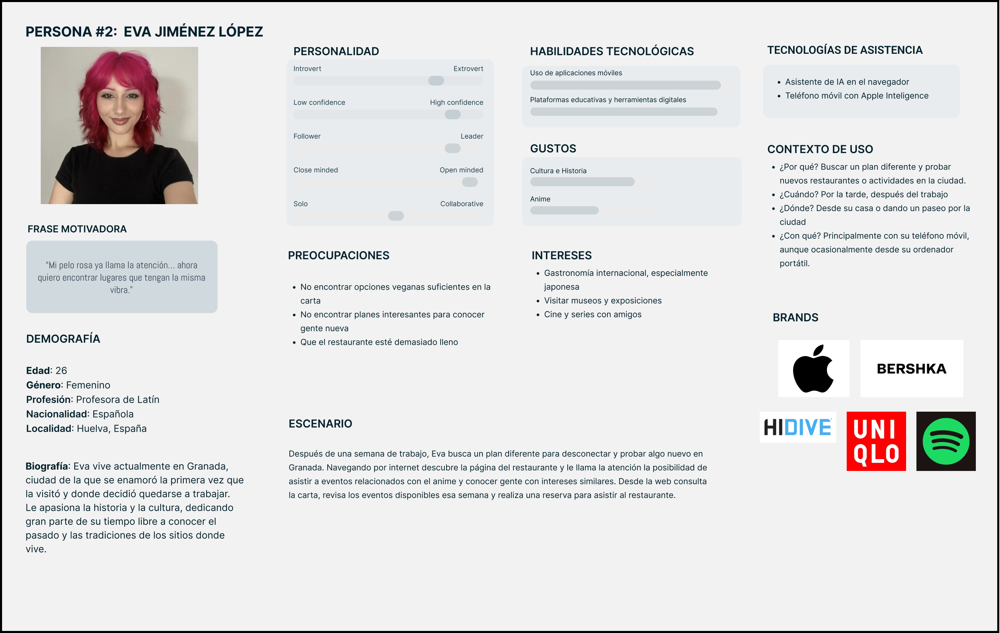
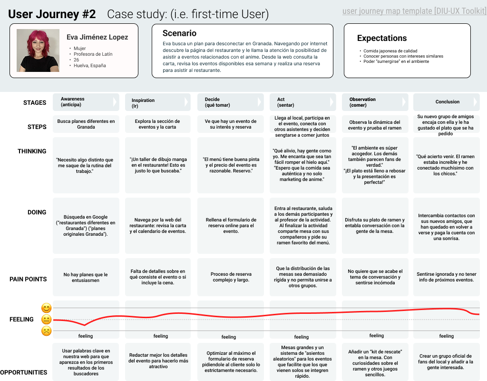

# Práctica 1 
## 1.a User Reseach Plan
El objetivo de este plan de investigación es comprender cómo interactúan los usuarios con las plataformas web de restaurantes temáticos y detectar posibles problemas de usabilidad antes de diseñar nuestra propuesta.

### Contexto y antecedentes
El restaurante elegido como referencia para el análisis es _Buga Ramen_, una cadena de restauración japonesa presente en varias ciudades de España. Su popularidad y reconocimiento la convierten en un caso de estudio adecuado para analizar estrategias de diseño digital, identidad visual y experiencia de usuario aplicadas a restaurantes temáticos.

Esta elección responde a la intención de estudiar los elementos que han contribuido a su éxito. El proyecto buscará inspiración en ellos para desarrollar una propuesta de diseño web que sea reconocible y diferenciadora en el entorno digital.
 - **Identidad Visual:** La web de Buga Ramen utiliza una paleta de colores muy llamativa y una estética fuertemente asociada a la cultura japonesa.
   
 - **Calidad de Producto:** La reputación del restaurante está asociada a la calidad de sus productos. Nuestro objetivo es trasladar esta percepción positiva también al diseño digital, creando una experiencia coherente entre el producto y la interfaz web.

### Objetivos de investigación
El objetivo principal de la investigación es comprender cómo interactúan los usuarios con plataformas digitales de restaurantes de este tipo, con el fin de diseñar una web intuitiva, accesible y agradable de utilizar.

Para ello se analizarán las necesidades, expectativas y comportamientos de los usuarios durante acciones habituales como consultar la carta, buscar información del local o realizar una reserva.

También buscamos crear una marca reconocible ya que una marca fuerte facilita la penetración en el público objetivo, genera confianza y, en última instancia, contribuye a aumentar la base de clientes a largo plazo.

### Metodología
Combinaremos métodos de análisis digital con técnicas de recopilación de información directa de los usuarios.

En primer lugar, se realizará un **análisis del entorno digital** y de la presencia de la marca en redes sociales para identificar tendencias, opiniones de los clientes y oportunidades de mejora. 

Posteriormente, vamos a desarrollar **personas** que representen a los principales tipos de usuarios del servicio, lo que permitirá comprender mejor sus motivaciones y necesidades.

Además, elaboraremos **Journey Maps** para analizar el recorrido del usuario con la marca, desde desde el momento en que surge la intención de visitar el restaurante hasta la finalización de la experiencia. 

Finalmente,se complementará el estudio mediante **entrevistas y encuestas** a usuarios, con el objetivo de obtener información directa sobre sus expectativas, preferencias y posibles dificultades al interactuar con este tipo de plataformas.

La combinación de estos métodos permitirá obtener una visión completa del comportamiento de los usuarios y facilitará el desarrollo de nuestra propuesta de diseño centrada en mejorar la experiencia de uso de la plataforma web.

## 1.b Competitive Analysis

>>> Describe brevemente características de las aplicaciones que tiene asignadas tu grupo. Decidete por una y explica por qué se ha seleccionado. Borra esta línea cuando lo tengas. 

### 👤 1.c Personas
Para entender a nuestro público, hemos desarrollado dos perfiles representativos. 

Por un lado, tenemos a Alberto un joven apasionado del Anime y de los videojuegos.

#### 1.d User Journey Map
Analizamos el recorrido de **Alberto**, este usuario busca nuevas experiencias.
El mapa nos muestra que aunque la temática le atrae, la falta de claridad en la página web le generó dudas antes de la visita.

### 1.e Usability Review

**Puntación obtenida por Buga Ramen: 64/100** 
Su página web cumple los requisitos mínimos exigibles para ser agradable al usuario. El sitio web es funcional pero presenta fallos de usabilidad notables.
La jerarquía de información es confusa y la estética a veces sacrifica la legibilidad. Esto nos da una ventaja competitiva: podemos ofrecer la misma potencia visual pero con una arquitectura de información más clara.

---
