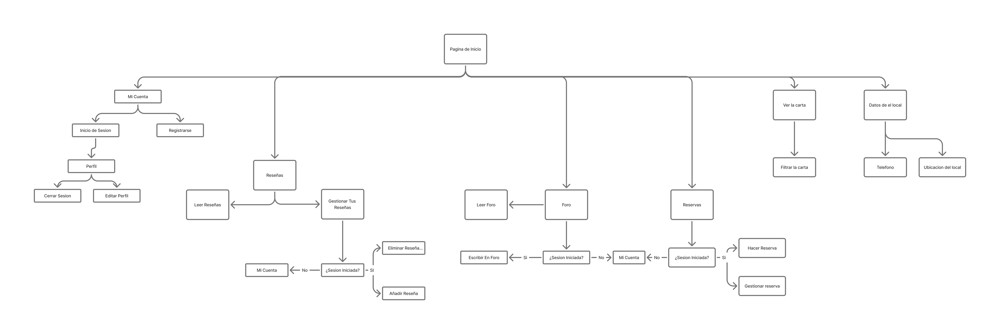

# Práctica 2 :ramen: Ideación y diseño

## 1. Ideación

Tras la investigación realizada en la práctica anterior, decidimos replantear nuestra propuesta de valor poniendo el foco no solo en la experiencia gastronómica, sino también en la dimensión social y temática que diferencia a Pa’ya.

A partir de los insights extraídos, hemos utilizado distintas herramientas de ideación para sintetizar la información y orientar el diseño hacia una solución más coherente con nuestro público objetivo.

### 1.1 Feedback Capture Grid 

Para estructurar esta fase de ideación, comenzamos utilizando una **malla receptora de información**, que nos permitió sintetizar la información obtenida en cuatro áreas clave: aspectos positivos del modelo actual, críticas constructivas, preguntas surgidas desde la perspectiva de los usuarios y posibles ideas de mejora planteadas por el equipo.

Gracias a esta herramienta identificamos fortalezas importantes, como el atractivo de la temática anime y la diferenciación del restaurante dentro de la oferta gastronómica de Granada. Al mismo tiempo, detectamos oportunidades de mejora relacionadas con la dificultad para acceder a información clara sobre eventos, la gestión de reservas, la incertidumbre sobre el aforo y la falta de herramientas que favorezcan la interacción entre usuarios con gustos similares.

### 1.2 Empathy Mapping  

Mediante los **mapas de empatía** profundizamos en las necesidades reales de los usuarios, elaborados a partir de nuestras personas ficticias: Alberto y Eva.

 

El uso de ambos mapas nos permitió detectar pain points comunes, como la dificultad para encontrar plaza en eventos temáticos, la necesidad de reservas rápidas, la falta de tiempo en el ritmo de vida actual o la barrera social de no tener con quién acudir. A su vez, identificamos motivaciones compartidas, entre ellas descubrir nuevos sabores, conocer personas afines y formar parte de una comunidad activa en torno al anime y la cultura japonesa.

El análisis conjunto de la malla receptora y los mapas de empatía nos permitió validar que la propuesta debía ir más allá de la experiencia gastronómica tradicional. A partir de estos hallazgos, definimos una propuesta de valor centrada en la socialización, la cultura anime y la creación de comunidad, profundizando en funcionalidades que integran reservas inteligentes, eventos temáticos y una plataforma social para conectar a usuarios con intereses comunes.

 

## 2. Propuesta de valor

Nuestra propuesta de valor transforma la experiencia tradicional de un restaurante temático en una plataforma social y gastronómica centrada en la cultura anime y japonesa. Pa’ya no solo ofrece un espacio donde disfrutar de ramen y gastronomía oriental, sino también un entorno digital diseñado para facilitar la conexión entre usuarios.

La solución integra reservas inteligentes, acceso a la carta digital, gestión de eventos temáticos y una plataforma social tipo foro, donde los usuarios pueden interactuar, compartir reseñas, recomendar platos, organizar planes y conocer nuevas personas. 

Uno de los pilares fundamentales de la propuesta es la **creación de comunidad**, permitiendo que los usuarios no solo visiten el restaurante de forma habitual, sino que lo conviertan en un punto de encuentro para personas apasionadas del anime, la cultura japonesa y la gastronomía oriental. Los eventos temáticos, las dinámicas sociales y las funcionalidades colaborativas dentro del sitio web refuerzan este sentimiento de pertenencia y aumentan la recurrencia de visitas.

Además, la propuesta está diseñada para ser accesible y útil para distintos perfiles de usuario, desde jóvenes aficionados al anime hasta personas menos familiarizadas con todo ese mundo, ofreciendo una experiencia intuitiva, inmersiva y adaptable a diferentes edades y necesidades.

En definitiva, Pa’ya evoluciona de restaurante temático a ecosistema digital de experiencia, socialización y comunidad, donde cada visita supone una oportunidad para descubrir nuevos sabores, participar en actividades y generar conexiones reales con otras personas.

 

## 3. Task analysis y arquitectura de la información

### 3.1 Análisis de tareas 

* #### User Task Matrix
Vamos a identificar las tareas principales y su relevancia para los distintos usuarios. 

| Tarea | Usuario | Usuario Registrado | Trabajadores | Joven Otaku | Adulto No Conocedor |
|---|---|---|---|---|---|
| Ver la carta | Alta | Alta | Baja | Alta | Alta |
| Opciones de filtrado de la carta | Moderada | Alta | Baja | Moderada | Alta |
| Leer reseñas y recomendaciones | Moderada | Alta | Baja | Alta | Alta |
| Acceder a datos del local | Moderada | Moderada | Alta | Baja | Alta |
| Consultar eventos temáticos | Moderada | Alta | Moderada | Alta | Moderada |
| Iniciar sesión | No usa | Alta | Alta | Alta | Baja |
| Hacer reserva | Moderada | Alta | Baja | Alta | Alta |
| Reservar plaza en eventos | No usa | Alta | Baja | Alta | Moderada |
| Acceder al foro | Baja | Alta | Moderada | Alta | Baja |
| Publicar en el foro | No usa | Moderada | Baja | Alta | No usa |
| Gestionar cuenta | No usa | Moderada | Alta | Moderada | Baja |
| Gestionar reservas | No usa | Baja | Alta | Baja | No usa |
| Gestionar eventos y aforo | No usa | No usa | Alta | No usa | No usa |
| Cerrar sesión | No usa | Moderada | Alta | Moderada | Baja |

* #### User/Task Flow
Mostramos el flujo de las tres tareas que consideramos más importantes:

> **1) Consultar la carta y reservar mesa**
  
  **2) Consultar eventos temáticos y reservar plaza**
  
  **3) Participar en el foro**
  

### 3.2 Arquitectura de la información 

En este apartado realizaremos una organización de navegacion (menús) y etiquetas (**labeling**)

Proponer una organización lógica de la navegación y elementos de diseño.En este paso, se genera el mapa (sitemap) junto con el etiquetado (labelling) del sitio (incluyendo iconos), que se puede usar posteriormente para internacionalización. 

  
  
## 4. Prototipo

Se harán bocetos **Lo-Fi PARA WEB** (tamaño 1440px, grid de 12 columnas) de las distintas pantallas del interfaz (las más relevantes). Se propone un proceso incremental: 

a)  un **primer esbozo en PAPEL** que será evaluado  por profesor/a). Una vez clara la idea se procederá a hacer diseño en FIGMA en dos pasos. 

b)  Wireframe preliminar en FIGMA (posiciones fijas absolutas, y **elementos en jerarquía de frames**). 

*  Escoger **escala de grises** y **una  tipografía**. 
* Identificar cabeceras y menús, pero el contenido se  ajusta con "lorem ipsum"
* las imágenes se ajustan con un rectángulo (tachado) con tamaño aproximado

 DEBE QUEDAR MUY CLARA LA JERARQUIA VISUAL CON FRAMES Y DESTACAR COMPONENTES PRINCIPALES
c)  Una vez VALIDADO en clase, se hará una segunda versión con un **GRID LAYOUT con ajustes de diseño RESPONSIVE**(para ver su comportamiento en distintos dispositivos) 

  
