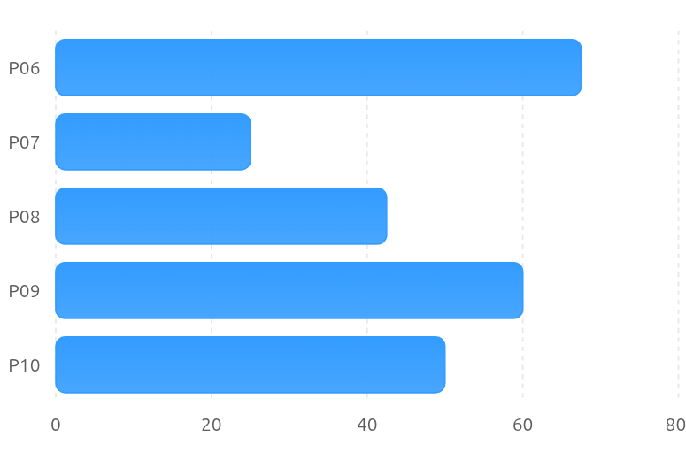

# Usability Report

### Evaluación de usabilidad del proyecto DIU3.RESCUE
[Enlace a GITHUB del proyecto DIU3.RESCUE](https://github.com/Practicas-DIU3-RESCUE/UX_CaseStudy). Informe realizado por Equipo DIU1.PA'YA 

## 1 RESUMEN EJECUTIVO  (Executive Summary)

### Objetivo
El objetivo de este informe es evaluar la usabilidad del sistema DIU3.RESCUE mediante la aplicación de diferentes técnicas de evaluación centradas en el usuario. Se pretende identificar problemas de navegación, accesibilidad y experiencia de usuario que puedan afectar a la interacción con la plataforma.

### Metodología
La evaluación se llevó a cabo utilizando tres técnicas complementarias:
 - Cuestionario System Usability Scale (SUS) para medir la percepción subjetiva de usabilidad.
 - Análisis Eye Tracking mediante GazeMapping para estudiar la atención visual de los usuarios.
 - Auditoría de accesibilidad basada en herramientas automáticas y revisión manual.

### Principales Hallazgos
 - Los usuarios encontraron dificultades para orientarse durante la navegación y localizar determinadas funcionalidades.
 - Algunos elementos importantes de la interfaz recibieron poca atención visual durante las pruebas.
 - La puntuación SUS obtenida refleja una percepción de usabilidad inferior a la recomendada para aplicaciones con una buena experiencia de usuario.
  
### Resultado Global
DIU3.RESCUE obtuvo una puntuación media SUS de 49.0 puntos. Según la interpretación estándar de la escala SUS, este resultado indica una usabilidad deficiente y pone de manifiesto la necesidad de realizar mejoras en distintos aspectos de la interfaz.

## 2. Metodología y Reclutamiento

### Perfil de los participantes
La evaluación se realizó con usuarios de diferentes edades, ocupaciones y niveles de experiencia tecnológica. Los participantes presentaban perfiles variados, desde estudiantes universitarios con alta experiencia digital hasta personas de edad avanzada con competencias tecnológicas más limitadas.

Esta diversidad permitió analizar el comportamiento de distintos tipos de usuarios ante las funcionalidades ofrecidas por el sistema.

### Escenario de la prueba
Los participantes realizaron dos tareas principales:

#### Tarea 1. Consulta de la carta
El usuario debía localizar y acceder a la sección correspondiente al menú de productos.

#### Tarea 2. Retorno a la página principal
Una vez finalizada la tarea anterior, el usuario debía regresar a la página de inicio utilizando los mecanismos de navegación disponibles.

Durante las pruebas se observaron tiempos de ejecución, errores de navegación, dudas de orientación y comportamiento visual.

### Herramientas
 - Tally para la recogida de respuestas del cuestionario SUS.
 - GazeMapping para la obtención de mapas de calor y análisis visual.
 - Lighthouse y WAVE (Web Accessibility Evaluation Tool) como herramientas de evaluación de accesibilidad.

## 3. Resultados del Cuestionario SUS (Datos Cuantitativos)

| Metrica     | Caso A PAYA | Caso B Rescue     
| ----------- | ----------  | -------------- 
| Media SUS   |      87.5   | 49.0              
| Eval Lingüística |  Excelente  | Deficiente               
| Max Score   |     100.0   | 67.5               
| Min Score   |     60.0    | 25.0    

El sistema DIU3.RESCUE obtuvo una puntuación media SUS de 49.0 puntos. Este resultado se encuentra por debajo del valor de referencia de 68 puntos utilizado habitualmente para considerar aceptable la usabilidad de un sistema. La puntuación indica que los usuarios perciben dificultades durante la interacción y que existen aspectos importantes susceptibles de mejora.

En la siguiente gráfica se muestran los resultados individuales durante la evalución. 

Se observa una alta variabilidad entre participantes. Mientras que algunos usuarios otorgaron puntuaciones cercanas al umbral de aceptabilidad, otros valoraron la experiencia de forma claramente negativa. Esta dispersión indica que la interacción con el sistema no resulta igualmente satisfactoria para todos los perfiles de usuario.

### Desglose por ítems del cuestionario SUS
Las preguntas con peores valoraciones fueron aquellas relacionadas con la frecuencia de uso, la integración de funcionalidades y la consistencia del sistema. En particular, la afirmación "Creo que me gustaría usar este sistema con frecuencia" obtuvo una media de 1.4 sobre 5, lo que indica una baja predisposición de los participantes a volver a utilizar la plataforma. Asimismo, la pregunta "Encontré que las diversas funciones de este sistema estaban bien integradas" obtuvo una media de 2.0, sugiriendo que los usuarios percibieron cierta desconexión entre las diferentes funcionalidades ofrecidas.

Por otra parte, las preguntas negativas relacionadas con la complejidad e inconsistencia del sistema presentaron valores relativamente elevados. La afirmación "Pensé que había demasiada inconsistencia en este sistema" obtuvo una media de 3.4, mientras que "Encontré el sistema innecesariamente complejo" alcanzó una media de 3.2. Estos resultados indican que varios usuarios experimentaron dificultades para comprender el funcionamiento general de la interfaz.

También se observaron puntuaciones moderadas en cuestiones relacionadas con la facilidad de aprendizaje y la confianza durante el uso, lo que sugiere que, aunque algunos usuarios consiguieron completar las tareas propuestas, la experiencia no resultó completamente intuitiva ni satisfactoria.

En conjunto, el análisis por ítems confirma que los principales problemas de DIU3.RESCUE están relacionados con la navegación, la coherencia entre funcionalidades y la percepción general de complejidad del sistema, factores que contribuyen directamente a la baja puntuación SUS obtenida.

| Pregunta SUS     | Media     
| -----------      | ---------- 
| P1. Me gustaría usar este sistema con frecuencia     |      1.4             
| P2. Encontré el sistema innecesariamente complejo    |      3.2              
| P3. El sistema era fácil de usar                     |      3.2                 
| P4. Necesitaría ayuda técnica                        |      1.6    
| P5. Las funciones estaban bien integradas            |      2.0              
| P6. Había demasiada inconsistencia                   |      3.4              
| P7. La mayoría aprendería a usarlo rápidamente       |      3.2                 
| P8. El sistema era engorroso de usar                 |      3.0  
| P9. Me sentí confiado al usarlo                      |      3.4                 
| P10. Necesité aprender muchas cosas antes de usarlo  |      2.4  

## 4. Análisis de Eye Tracking (Datos Biométricos)

**Participante 6**
| Prueba 1: Buscar la Carta | Prueba 2: Volver al Inicio |
| :---: | :---: |
|  |  |

**Participante 7**
| Prueba 1: Buscar la Carta | Prueba 2: Volver al Inicio |
| :---: | :---: |
|  |  |

**Participante 8**
| Prueba 1: Buscar la Carta | Prueba 2: Volver al Inicio |
| :---: | :---: |
|  |  |

**Participante 9**
| Prueba 1: Buscar la Carta | Prueba 2: Volver al Inicio |
| :---: | :---: |
|  |  |

**Participante 10**
| Prueba 1: Buscar la Carta | Prueba 2: Volver al Inicio |
| :---: | :---: |
|  |  |

### Hallazgos principales

#### Tarea 1: Localización de la carta
En esta prueba hemos observado que la mayoría de los usuarios necesitó explorar diferentes áreas de la página antes de identificar el acceso a la carta. El mapa de calor presenta numerosas zonas de alta intensidad distribuidas por toda la interfaz, evidenciando una búsqueda visual extensa en lugar de una localización directa del elemento objetivo.

Uno de los factores que parece haber contribuido a esta dificultad es la denominación utilizada para acceder a la carta. Los usuarios esperaban encontrar una opción etiquetada explícitamente como "Carta" o "Menú", pero la funcionalidad aparece bajo el nombre "Paseo de la Fama", una denominación poco intuitiva para quienes visitan la página por primera vez.

Como consecuencia, la mayoría de los usuarios necesitaron más de un clic para completar la tarea, lo que sugiere que la arquitectura de la información y el etiquetado de los elementos de navegación no comunican adecuadamente el contenido que contienen.

#### Tarea 2: Retorno a la página de inicio
Durante la segunda prueba se observó un patrón de comportamiento mucho más claro. La mayoría de los participantes intentó regresar a la página principal pulsando sobre el logo, siguiendo una convención ampliamente extendida en el diseño web.

No obstante, la ausencia del menú de navegación en esta página provocó que algunos usuarios tardaran más de lo esperado en completar la tarea. Aquellos participantes que no asociaron inmediatamente el logotipo con la función de retorno al inicio mostraron dudas sobre cómo volver a la página principal y realizaron exploraciones adicionales de la interfaz antes de encontrar una solución.

Este comportamiento sugiere que el sistema depende excesivamente de convenciones implícitas conocidas solamente por usuarios experimentados.

#### Conclusión del análisis Eye Tracking

Los resultados obtenidos muestran problemas relacionados con la visibilidad de determinadas funcionalidades, la nomenclatura utilizada en algunos apartados y la orientación durante la navegación. La dispersión observada en los mapas de calor, especialmente durante la primera tarea, indica que los usuarios deben dedicar un esfuerzo cognitivo elevado para localizar acciones que deberían ser fácilmente identificables. Una mejora en el etiquetado de las opciones, junto con una estructura de navegación más clara y consistente, contribuiría significativamente a reducir los tiempos de búsqueda y aumentar la eficiencia de uso del sistema.

## 5. Auditoría de Accesibilidad
[Enlace al informe de accesibilidad](Acceibility-Report-template.md)

## 6. Conclusiones y Recomendaciones (Actionable Insights)

| **Prioridad**      | **Hallazgo**                                                 | **Recomendación de Mejora**                                  |
| ------------------ | ------------------------------------------------------------ | ------------------------------------------------------------ |
| **🔴Alta (Crítica)** | **Etiquetado confuso de la Carta** El mapa de calor muestra una búsqueda visual dispersa debido a que la carta está oculta bajo el nombre no intuitivo de "Paseo de la Fama" | Cambiar el nombre del enlace del menú a etiquetas claras y convencionales como "Carta" o "Menú", garantizando su localización directa con un solo clic. |
| **🔴Alta (Crítica)** | **Etiquetado confuso de la Carta** El mapa de calor muestra una búsqueda visual dispersa debido a que la carta está oculta bajo el nombre no intuitivo de "Paseo de la Fama" | Cambiar el nombre del enlace del menú a etiquetas claras y convencionales como "Carta" o "Menú", garantizando su localización directa con un solo clic. |
| **Media**          | Ej. Los usuarios no ven el botón de registro rápidamente.        | Cambiar el color del CTA a uno de mayor contraste según WCAG. |
| **Baja**           | Ej. El logo no redirige a la home.                               | Añadir el enlace estándar al logotipo en la cabecera.        |

