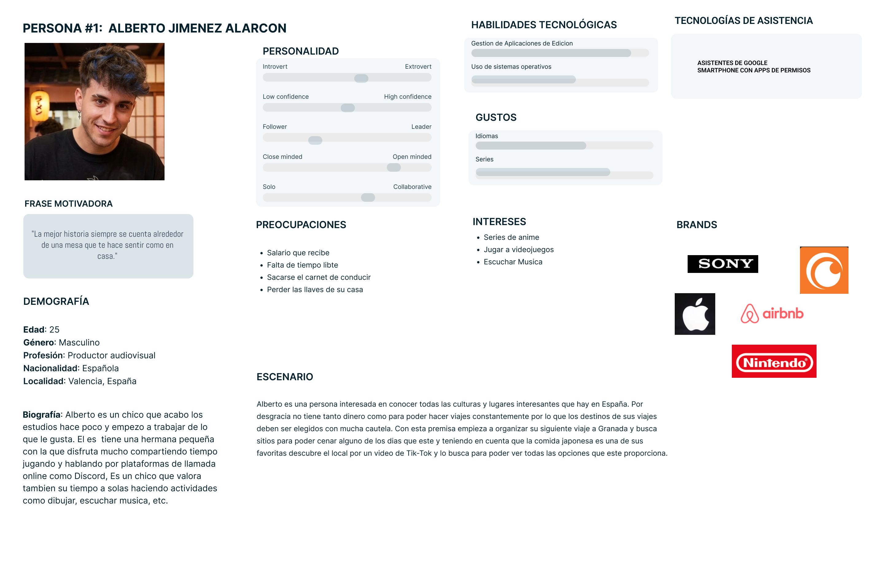
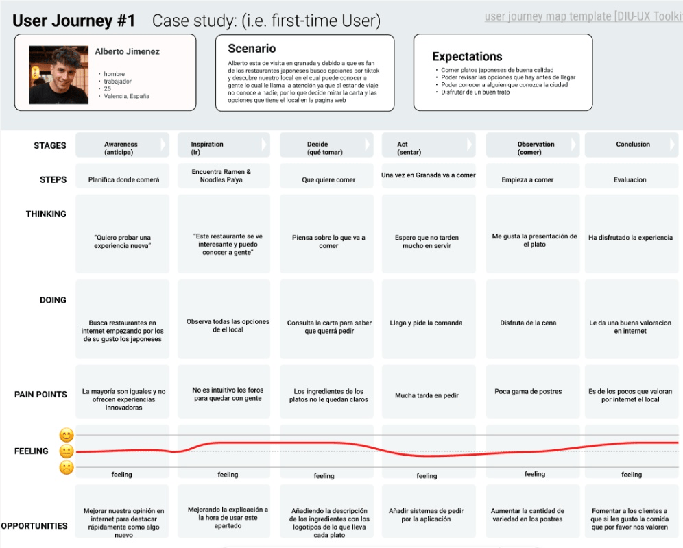

# DIU 26 🍜 Ramen & Noodles Pa'ya
**Grupo:** DIU1_PAYA | **Curso:** 2025/26  

---

## 0. My UX-Case Study
 

### Descripción del Proyecto
**Ramen & Noodles Pa'ya** es una propuesta que se aleja del concepto de restaurante convencional en Granada. Nuestra plataforma web estará orientada a fomentar la creación de lazos y actividades sociales en Granada, tomando como base la gastronomía japonesa.

La plataforma incluirá las funcionales habituales de la página web de un restaurante, como consultar la carta, hacer reservas para acudir al local, ver la ubicación de el restaurante o acceder a información de contacto como el número de telefono.

Ahora bien, el elemento que nos diferenciará de los competidores será la promoción de actividades sociales. Para ello, se organizarán eventos semanales (talleres de manga, debates de anime, concursos de cosplay...). Además, nuestra plataforma permitirá a los usuarios crear o unirse a grupos para ir a comer al restaurante con otras personas, fomentando la creación de nuevas relaciones.

Logotipo: 

>>> Si diseña un logotipo para su producto en la práctica 3 pongalo aqui, a un tamaño adecuado. Si diseña un slogan añadalo aquí

Miembros y nombre del equipo: DIU1_PAYA
 * :bust_in_silhouette:  Pablo Hodar Molina     — [:octocat: GitHub](https://github.com/ph0darm)   
 * :bust_in_silhouette:  Yaiza Perez Ocaña      — [:octocat: GitHub](https://github.com/yaizaperez)

---

## 1. UX User & Analisis 

### 1.a User Reseach Plan
 
-----

El restaurante elegido como referencia para el diseño de la nueva página web es _Buga Ramen_, una cadena de restauración japonesa presente en varias ciudades de España. Su popularidad y reconocimiento la convierten en un caso de estudio adecuado para analizar estrategias de diseño digital, identidad visual y experiencia de usuario aplicadas a restaurantes temáticos.

Esta elección responde a la intención de estudiar los elementos que han contribuido a su éxito. El proyecto buscará inspiración en ellos para desarrollar una propuesta de diseño web que sea reconocible y diferenciadora en el entorno digital.
Identidad Visual: Se utilizará una paleta de colores muy llamativa de Buga Ramen. Esta elección busca generar una seña de identidad visual potente y distintiva en el entorno digital, esencial para la memorabilidad de la marca y para destacar frente a la competencia.
Calidad de Producto: La alta calidad alimentaria del restaurante es un pilar crucial que se pretende mantener. El proyecto replicará este valor a través de la selección de un proveedor de confianza, asegurando que el estándar de calidad se refleje tanto en el servicio como en la percepción del cliente.

El **Objetivo Principal de la Investigación** es comprender cómo interactúan los usuarios con plataformas digitales de restaurantes de este tipo, con el fin de diseñar un sitio web intuitivo y accesible que haga del proceso de navegación una expriencia agradable y sencilla.
Para ello se analizarán las necesidades, expectativas y comportamientos de los usuarios durante acciones habituales como consultar la carta, buscar información del local o realizar una reserva.

También buscamos crear una marca reconocible ya que una marca fuerte facilita la penetración en el público objetivo, genera confianza y, en última instancia, contribuye a aumentar la base de clientes a largo plazo.

La **estrategia de investigación** combinará métodos de análisis digital con técnicas de recopilación de información directa de los usuarios.

En primer lugar, se realizará un análisis del entorno digital y de la presencia de la marca en redes sociales para identificar tendencias, opiniones de los clientes y oportunidades de mejora. Posteriormente, vamos a desarrollar personas que representen a los principales tipos de usuarios del servicio, lo que permitirá comprender mejor sus motivaciones y necesidades.
Además, elaboraremos **Journey Maps** para analizar el recorrido del usuario con la marca, desde desde el momento en que surge la intención de visitar el restaurante hasta la finalización de la experiencia. Este mapeo ayuda a identificar los momentos de frustración o dificultad y los momentos de satisfacción para optimizar cada interacción.

Finalmente,se complementará el estudio mediante entrevistas y encuestas a usuarios, con el objetivo de obtener información directa sobre sus expectativas, preferencias y posibles dificultades al interactuar con este tipo de plataformas.

La combinación de estos métodos permitirá obtener una visión completa del comportamiento de los usuarios y facilitará el desarrollo de nuestra propuesta de diseño centrada en mejorar la experiencia de uso de la plataforma web.

### 1.b Competitive Analysis
 
-----

>>> Describe brevemente características de las aplicaciones que tiene asignadas tu grupo. Decidete por una y explica por qué se ha seleccionado. Borra esta línea cuando lo tengas. 

### 👤 1.c Personas
 
-----

Para entender a nuestro público, hemos desarrollado dos perfiles representativos. 

Por un lado tenemos a un joven que está metido dentro del mundo de las series japonesas y los videojuegos.

#### 1.d User Journey Map
 
----

Analizamos el recorrido de **Alberto**, este usuario busca nuevas experiencias.
El mapa nos muestra que aunque la temática le atrae, la falta de claridad en la página web le generó dudas antes de la visita.

### 1.e Usability Review
 
----

**Puntación obtenida por Buga Ramen: 64/100** 
Su página web cumple los requisitos mínimos exigibles para ser agradable al usuario. El sitio web es funcional pero presenta fallos de usabilidad notables.
La jerarquía de información es confusa y la estética a veces sacrifica la legibilidad. Esto nos da una ventaja competitiva: podemos ofrecer la misma potencia visual pero con una arquitectura de información más clara.

---

## Paso 2. UX Design  

>>> Cualquier título puede ser adaptado. Recuerda borrar estos comentarios del template en tu documento

### 2.a Reframing / IDEACION: Feedback Capture Grid / EMpathy map 
 
----

>>> Comenta con un diagrama los aspectos más destacados a modo de conclusion de la práctica anterior. De qué carece la competencia?? Tu diagrama puede ser una figura subida a la carpeta P2/

 Interesante | Críticas     
| ------------- | -------
  Preguntas | Nuevas ideas
  
    
>>> Explica el Problema y plantea una hipótesis. Es decir, explica aquí qué 
>>> se plantea como "propuesta de valor" para un nuevo diseño de aplicación propio

### 2.b ScopeCanvas

----

>>> Propuesta de valor, pero ahora en vez de un texto es un ScopeCanvas que has subido a P2/ y enlazado desde aqui. Tambien vale una imagen miniatura del recurso.
>>> No olvides que tu propuesta ya tiene un nombre corto y puedes actualizar la cabecera de este archivo

### 2.b User Flow (task) analysis 
 
-----

>>> Definir "User Map" y "Task Flow" ... enlazar desde P2/ y describir brevemente

### 2.c IA: Sitemap + Labelling 
 
----

>>> Identificar términos para diálogo con usuario (evita el spanglish) y la arquitectura de la información. Es muy apropiado un diagrama tipo sitemap y una tabla que se ampliaría para llevar asociado la columna iconos (tanto para la web como para una app). 

Término | Significado     
| ------------- | -------
  Login  | acceder a plataforma

### 2.d Wireframes
 
-----

>>> Plantear el diseño del layout para Web/movil (organización y simulación). Describa la herramienta usada 

 

## Paso 3. Mi UX-Case Study (diseño)

>>> Cualquier título puede ser adaptado. Recuerda borrar estos comentarios del template en tu documento

### 3.a Moodboard

-----

>>> Diseño visual con una guía de estilos visual (moodboard) 
>>> Incluir Logotipo. Todos los recursos estarán subidos a la carpeta P3/
>>> Explique aqui la/s herramienta/s utilizada/s y el por qué de la resolución empleada. Reflexione ¿Se puede usar esta imagen como cabecera de Instagram, por ejemplo, o se necesitan otras?

### 3.b Landing Page
 
----

>>> Plantear el Landing Page del producto. Aplica estilos definidos en el moodboard

### 3.c Guidelines
 
----

>>> Estudio de Guidelines y explicación de los Patrones IU a usar 
>>> Es decir, tras documentarse, muestre las deciones tomadas sobre Patrones IU a usar para la fase siguiente de prototipado. 

### 3.d Mockup
 
----

>>> Consiste en tener un Layout en acción. Un Mockup es un prototipo HTML que permite simular tareas con estilo de IU seleccionado. Muy útil para compartir con stakeholders

 

## Paso 4. Pruebas de Evaluación 

### 4.a Reclutamiento de usuarios 

-----

>>> Breve descripción del caso asignado (llamado Caso-B) con enlace al repositorio Github
>>> Tabla y asignación de personas ficticias (o reales) a las pruebas. Exprese las ideas de posibles situaciones conflictivas de esa persona en las propuestas evaluadas. Mínimo 4 usuarios: asigne 2 al Caso A y 2 al caso B.

| Usuarios | Sexo/Edad     | Ocupación   |  Exp.TIC    | Personalidad | Plataforma | Caso
| ------------- | -------- | ----------- | ----------- | -----------  | ---------- | ----
| User1's name  | H / 18   | Estudiante  | Media       | Introvertido | Web.       | A 
| User2's name  | H / 18   | Estudiante  | Media       | Timido       | Web        | A 
| User3's name  | M / 35   | Abogado     | Baja        | Emocional    | móvil      | B 
| User4's name  | H / 18   | Estudiante  | Media       | Racional     | Web        | B 

### 4.b Diseño de las pruebas 
 
-----

>>> Planifique qué pruebas se van a desarrollar. ¿En qué consisten? ¿Se hará uso del checklist de la P1?

### 4.c Cuestionario SUS
 
----

>>> Como uno de los test para la prueba A/B testing, usaremos el **Cuestionario SUS** que permite valorar la satisfacción de cada usuario con el diseño utilizado (casos A o B). Para calcular la valoración numérica y la etiqueta linguistica resultante usamos la [hoja de cálculo](https://github.com/mgea/DIU19/blob/master/Cuestionario%20SUS%20DIU.xlsx). Previamente conozca en qué consiste la escala SUS y cómo se interpretan sus resultados
http://usabilitygeek.com/how-to-use-the-system-usability-scale-sus-to-evaluate-the-usability-of-your-website/)
Para más información, consultar aquí sobre la [metodología SUS](https://cui.unige.ch/isi/icle-wiki/_media/ipm:test-suschapt.pdf)
>>> Adjuntar en la carpeta P4/ el excel resultante y describa aquí la valoración personal de los resultados 

### 4.d A/B Testing
 
-----

>>> Los resultados de un A/B testing con 3 pruebas y 2 casos o alternativas daría como resultado una tabla de 3 filas y 2 columnas, además de un resultado agregado global. Especifique con claridad el resultado: qué caso es más usable, A o B?

### 4.e Aplicación del método Eye Tracking 

----

>>> Indica cómo se diseña el experimento y se reclutan los usuarios. Explica la herramienta / uso de gazerecorder.com u otra similar. Aplíquese únicamente al caso B.

  
>>> Cambiar esta img por una de vuestro experimento. El recurso deberá estar subido a la carpeta P4/  

>>> gazerecorder en versión de pruebas puede estar limitada a 3 usuarios para generar mapa de calor (crédito > 0 para que funcione) 

### 4.f Usability Report de B
 
-----

>>> Añadir report de usabilidad para práctica B (la de los compañeros) aportando resultados y valoración de cada debilidad de usabilidad. 
>>> Enlazar aqui con el archivo subido a P4/ que indica qué equipo evalua a qué otro equipo.

>>> Complementad el Case Study en su Paso 4 con una Valoración personal del equipo sobre esta tarea

 

## Paso 5. Exportación y Documentación 

### 5.a Exportación a HTML/React
 
----

>>> Breve descripción de esta tarea. Las evidencias de este paso quedan subidas a P5/

### 5.b Documentación con Storybook

----

>>> Breve descripción de esta tarea. Las evidencias de este paso quedan subidas a P5/

 

## Conclusiones finales & Valoración de las prácticas

>>> Opinión FINAL del proceso de desarrollo de diseño siguiendo metodología UX y valoración (positiva /negativa) de los resultados obtenidos. ¿Qué se puede mejorar? Recuerda que este tipo de texto se debe eliminar del template que se os proporciona 

