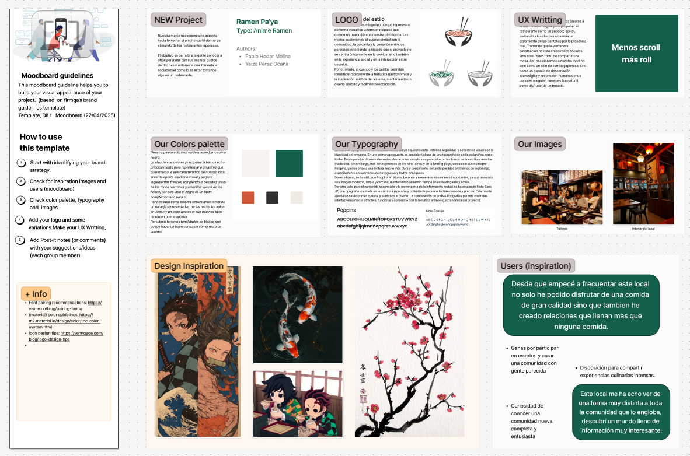
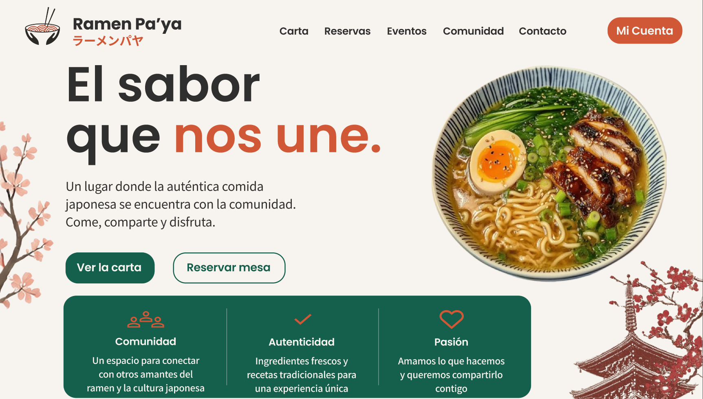
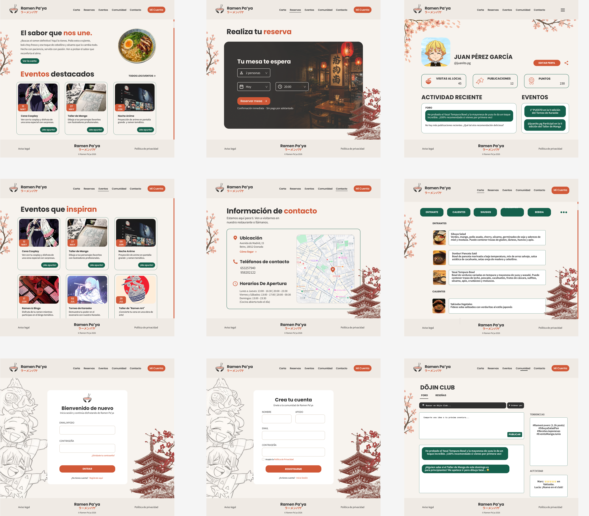

# DIU 26 :ramen: Ramen や Noodles Pa'ya
**Grupo:** DIU1_PAYA | **Curso:** 2025/26  

---

## 0. My UX-Case Study
### Descripción del Proyecto
**Ramen や Noodles Pa'ya** es una propuesta que se aleja del concepto de restaurante convencional en Granada. Nuestra plataforma web estará orientada a fomentar la creación de lazos y actividades sociales en Granada, tomando como base la gastronomía japonesa.

La plataforma incluirá las funcionales habituales de la página web de un restaurante, como consultar la carta, hacer reservas para acudir al local, ver la ubicación de el restaurante o acceder a información de contacto como el número de telefono.

Ahora bien, el elemento que nos diferenciará de los competidores será la promoción de actividades sociales. Para ello, se organizarán eventos semanales (talleres de manga, debates de anime, concursos de cosplay...). Además, nuestra plataforma permitirá a los usuarios crear o unirse a grupos para ir a comer al restaurante con otras personas, fomentando la creación de nuevas relaciones.

Logotipo: 

Eslogan:
Menos scroll más roll.

Miembros y nombre del equipo: DIU1_PAYA
 * :bust_in_silhouette:  Pablo Hodar Molina     — [:octocat: GitHub](https://github.com/ph0darm)   
 * :bust_in_silhouette:  Yaiza Perez Ocaña      — [:octocat: GitHub](https://github.com/yaizaperez)

 

# Proceso de Diseño 
## 1. UX User & Desk Research & Analisis 
### 1.a User Reseach Plan
El objetivo de este plan de investigación es comprender cómo interactúan los usuarios con las plataformas web de restaurantes temáticos y detectar posibles problemas de usabilidad antes de diseñar nuestra propuesta.

El restaurante elegido como referencia para el análisis es _Buga Ramen_, una cadena de restauración japonesa presente en varias ciudades de España. Su popularidad y reconocimiento la convierten en un caso de estudio adecuado para analizar estrategias de diseño digital, identidad visual y experiencia de usuario aplicadas a restaurantes temáticos.

 - **Identidad Visual:** La web de Buga Ramen utiliza una paleta de colores muy llamativa y una estética fuertemente asociada a la cultura japonesa.
   
 - **Calidad de Producto:** La reputación del restaurante está asociada a la calidad de sus productos. Nuestro objetivo es trasladar esta percepción positiva también al diseño digital, creando una experiencia coherente entre el producto y la interfaz web.
 - 
El **objetivo principal** de la investigación es comprender cómo interactúan los usuarios con plataformas digitales de restaurantes de este tipo, con el fin de diseñar una web intuitiva, accesible y agradable de utilizar.

### 1.b Competitive Analysis
Hemos realizado un análisis comparativo de tres referentes del sector.

Tras el analisis, observamos una clara oportunidad de mercado: **la mayoría de los competidores fallan en la integración total de servicios o en la accesibilidad**. 
Nuestra propuesta se diferenciará por combinar la inmersión visual de *Uzumaki* con la robustez técnica de *Shifu*, añadiendo la capa social de eventos que ninguna de estas plataformas ofrece actualmente

### 1.c Personas 
Para entender a nuestro público, hemos desarrollado dos perfiles representativos. 

Para representar a uno de los principales perfiles de usuarios, presentamos a **Alberto**, un joven interesado en el anime y los videojuegos.

Por otro lado, presentamos a **Eva**, profesora de latín interesada en actividades culturales que le permitan socializar y conocer gente con intereses similares. 

### 1.d User Journey Map
Analizamos los recorridos de nuestros dos perfiles principales para identificar puntos críticos en su experiencia:

* **Alberto:** Busca nuevas experiencias y salir de la monotonía. El mapa nos muestra que aunque la temática le atrae, la falta de claridad en la página web le generó dudas antes de la visita.

* **Eva:** Busca desconectar y conocer personas afines a ella. Su mapa muestra una evolución positiva: tras una fase de búsqueda de planes en Granada, logra una inmersión total gracias a los eventos temáticos del local, transformando una cena individual en una experiencia social satisfactoria.

### 1.e Usability Review
[:page_facing_up: Ver Usuability Review](P1/UsabilityreviewPuntuado.pdf)

**Puntación obtenida por Buga Ramen: 64/100 (Moderate)** 
Tras realizar el análisis hemos concluido que, aunque la página es funcional y cumple con los requisitos mínimos, presenta fallos de usabilidad que afectan a la experiencia del usuario.

En particular, la jerarquía de información es confusa y la estética a veces sacrifica la legibilidad del contenido. 
Esto nos da una **oportunidad de mejora**: podemos ofrecer la misma potencia visual pero con una arquitectura de información más clara y una navegación más intuitiva.

---
 

## 2. UX Design 

### 2.a IDEACION: Feedback Capture Grid / Empathy map 

Mediante el uso de una malla receptora de información, se logró identificar que el restaurante destaca en Granada por su temática anime y diferenciación, aunque presenta deficiencias críticas en la gestión de reservas y el acceso a información sobre eventos y aforo. Esta fase de análisis permitió detectar una oportunidad clave para desarrollar herramientas que mejoren la comunicación operativa y fomenten la interacción social entre usuarios con intereses comunes.

* Alberto

* Eva

### 2.b ScopeCanvas

Pa’ya evoluciona el restaurante temático hacia un ecosistema digital que fusiona gastronomía oriental con socialización real. Mediante reservas inteligentes, foros y eventos de anime, transformamos la cultura japonesa en un motor de comunidad accesible. Nuestra propuesta trasciende el plato para ofrecer una experiencia inmersiva donde cada visita genera conexiones auténticas. En definitiva, convertimos la pasión por el ramen en un punto de encuentro dinámico y recurrente.

 

### 2.b User Flow (task) analysis 
Mostramos el flujo de las tres tareas que consideramos más importantes:

 

 

 

### 2.c Sitemap + Labelling 

En este apartado realizaremos una organización de navegacion (menús) y etiquetas (labeling)

 

| Tarea | Usuario | Usuario Registrado | Trabajadores | Joven Otaku | Adulto No Conocedor |
|---|---|---|---|---|---|
| Ver la carta | Alta | Alta | Baja | Alta | Alta |
| Opciones de filtrado de la carta | Moderada | Alta | Baja | Moderada | Alta |
| Leer reseñas y recomendaciones | Moderada | Alta | Baja | Alta | Alta |
| Acceder a datos del local | Moderada | Moderada | Alta | Baja | Alta |
| Consultar eventos temáticos | Moderada | Alta | Moderada | Alta | Moderada |
| Iniciar sesión | No usa | Alta | Alta | Alta | Baja |
| Hacer reserva | Moderada | Alta | Baja | Alta | Alta |
| Reservar plaza en eventos | No usa | Alta | Baja | Alta | Moderada |
| Acceder al foro | Baja | Alta | Moderada | Alta | Baja |
| Publicar en el foro | No usa | Moderada | Baja | Alta | No usa |
| Gestionar cuenta | No usa | Moderada | Alta | Moderada | Baja |
| Gestionar reservas | No usa | Baja | Alta | Baja | No usa |
| Gestionar eventos y aforo | No usa | No usa | Alta | No usa | No usa |
| Cerrar sesión | No usa | Moderada | Alta | Moderada | Baja |

### 2.d Wireframes
En esta parte hemos desarrollado los wireframes Lo-Fi en Figma. Hemos definido los layouts más relevantes de nuestra interfaz. El objetivo principal en esta etapa ha sido hacer evidente la jerarquía visual, la organización espacial y el protagonismo de los componentes principales.

* Página de inicio

* Carta digital

* Página de reservas
 

* Página de próximos eventos

* El club de la comunidad Pa'ya

* Inicio de sesión

* Perfil de usuario

* Informacion del local

## 3. Mi UX-Case Study (diseño)

### 3.a Moodboard

Esta marca busca fusionar la tradición japonesa con la energía vibrante del pop art y el anime para proyectar una identidad joven, fresca y cercana. A través del uso estratégico del verde y el naranja, la propuesta intenta alejarse del concepto de comida rápida convencional, posicionándose como un espacio con alma e historia que celebra la cultura y conecta genuinamente con los gustos de su comunidad.

### 3.b Landing Page

La landing page utiliza el ramen como eje central para promover una experiencia social auténtica bajo el lema "El sabor que nos une". A través de un diseño limpio y directo, la marca busca proyectar transparencia, calidad y pasión, eliminando barreras con el cliente para invitarlo a formar parte de una comunidad. El objetivo final es ofrecer un espacio acogedor donde la tradición y la modernidad convergen, garantizando además una navegación sencilla y una funcionalidad impecable.

### 3.c Guidelines
# Guía de Arquitectura y Componentes: Ramen Pa'ya (V3)

## 1. Concepto y Propuesta de Valor
**Ramen Pa'ya** es una experiencia híbrida que combina la gastronomía japonesa auténtica con una comunidad activa de fans del anime. Bajo el lema **"Menos scroll, más roll"**, la interfaz prioriza la conexión real entre usuarios y una facilidad de uso excepcional.

## 2. Identidad Visual

### 2.1 Paleta de Colores
Se han seleccionado tonos que equilibran la frescura de los ingredientes con la calidez de la cultura japonesa:

| Muestra | Color | Uso en la Interfaz |
| :--- | :--- | :--- |
| #1A4A3A | **Verde Marino (#1A4A3A)** | Navegación, botones primarios y fondos de sección. |
| #D35400 | **Naranja Koi (#D35400)** | CTAs críticos, acentos visuales y fechas de eventos. |
| #FDF5E6 | **Crema Hueso (#FDF5E6)** | Fondo general (Background) para evitar la fatiga visual. |
| #333333 | **Gris Carbono (#333333)** | Textos principales y trazos de ilustraciones. |

### 2.2 Tipografía
* **Poppins (Bold/Regular):** Utilizada para todos los encabezados (H1-H4) y etiquetas de botones para transmitir modernidad y legibilidad.
* **Noto Sans JP:** Empleada en textos de párrafo y contenido secundario para aportar un toque cultural japonés y optimizar la lectura de caracteres especiales.

## 3. Layout Global y Navegación
La estructura se basa en tres áreas constantes para garantizar la consistencia:

1.  **Navbar (Sticky):** Contiene el logotipo, enlaces centrales (Carta, Reservas, Eventos, Comunidad, Contacto) y el acceso a "Mi Cuenta".
2.  **Área de Contenido:** Espacio dinámico para las diferentes secciones.
3.  **Footer:** Información legal, políticas de privacidad y copyright.

## 4. Anatomía de Páginas y Componentes

### 4.1 Página de Inicio (Home)
Presenta un patrón de **Hero Section** con texto descriptivo a la izquierda e imagen de impacto a la derecha. El botón **"Ver la carta"** destaca como el CTA primario. Incluye también una fila de tarjetas para **Eventos Destacados**.

### 4.2 Carta Digital (Navigation Tabs)

Utiliza un sistema de pestañas para la categorización eficiente del menú:

| Componente | Comportamiento |
| :--- | :--- |
| **Tabs de Categoría** | Filtro rápido (Entrantes, Ramen, etc.) que refresca el contenido sin recargar la página. |
| **List Item (Plato)** | Contenedor horizontal con imagen, título y descripción. |

### 4.3 Formulario de Reserva
Diseñado con campos de gran tamaño para facilitar la interacción:
* **Input de Número:** Para la selección de comensales.
* **Date & Time Picker:** Selectores específicos para fecha y hora (intervalos de 30 min).
* **Botón de Acción:** De ancho completo para optimizar el uso en dispositivos móviles.

### 4.4 Dōjin Club (Community Feed)
Espacio de interacción social que combina un **Post Composer** (para publicar texto e imágenes) con un **Feed de Actividad** y una barra lateral de tendencias.

### 4.5 Perfil de Usuario (Dashboard)
Organizado mediante widgets que muestran el avatar, métricas rápidas (puntos, reseñas, visitas) y un historial de actividad reciente.

## 5. Estados de Componentes
* **Hover State:** Las tarjetas se elevan con una sombra sutil y los botones oscurecen su color un 10%.
* **Empty States:** Ilustraciones estilo anime con mensajes motivadores cuando no hay contenido disponible.
* **Loading State:** Spinners personalizados con la forma de un cuenco de ramen girando.

## 6. Adaptabilidad (Responsive Design)
El diseño se adapta de una grilla de 3 o 4 columnas en escritorio a formatos verticales optimizados para dispositivos móviles.

### 3.d Mockup

El mockup de alta fidelidad (Hi-Fi) de Ramen Pa’ya presenta un ecosistema digital completo diseñado para ofrecer una experiencia de usuario (UX) inmersiva que integra la gestión gastronómica con la interacción social. La interfaz se estructura a través de nueve pantallas clave que incluyen una Home con jerarquía visual clara basada en el lema "El sabor que nos une", un sistema de reservas optimizado con selectores de fecha y hora, y un perfil de usuario personalizado que utiliza avatares de estilo anime y métricas de actividad (puntos y reseñas). La arquitectura se complementa con una carta digital organizada por categorías (entrantes, calientes, sushi), una sección de eventos comunitarios, mapas de contacto detallados y formularios de registro/login con ilustraciones motivadoras, culminando en el Dōjin Club, un foro social con feed de noticias y tendencias diseñado para fomentar la fidelización.

## 4. Exportación + Documentación

### 4.a Exportación a HTML/React
Este apartado representa la transición del diseño al código real, donde la interfaz de la aplicación se materializa en un entorno web operativo utilizando HTML y React. Este proceso traslada con éxito toda la lógica y funcionalidad del sitio —desde la navegación por la carta del restaurante hasta la interactividad de los formularios y el foro—, asegurando que la experiencia del usuario sea tan fluida y funcional como se proyectó en los prototipos.

[Enlace exportado](https://bot-excel-33662561.figma.site)

### 4.b Documentación con Storybook
En esta sección se detalla la creación de una biblioteca de componentes aislada y modular utilizando Storybook para gestionar el sistema de diseño de Ramen Pa'ya. A través de esta herramienta, se organizan y testean de forma independiente tanto los elementos atómicos (botones, campos de formulario) como las páginas completas, lo que permite verificar la consistencia visual, la interactividad y la accesibilidad de la plataforma de manera controlada antes de su despliegue final.

### 4.c Puntos fuertes y débiles
El análisis del diseño revela como puntos fuertes una identidad visual sumamente inmersiva gracias a la integración del concepto "Ramen + Anime/Manga" y una gran cohesión en la paleta cromática, tipografías y componentes; en contraposición, se identifican como puntos débiles la excesiva longitud de la pantalla de la carta (que exige demasiado scroll), problemas potenciales de legibilidad en la sección de reservas debido al contraste sobre el fondo fotográfico, y un exceso de espacio vertical en los formularios de inicio de sesión y registro.

### 4.d Conclusiones
Como balance de cierre, el proyecto demuestra que la sinergia entre un código web totalmente operativo y una documentación de componentes rigurosa es la clave del éxito del desarrollo. Este enfoque dual no solo garantiza que el producto actual respete fielmente la visión de diseño original, sino que establece una infraestructura técnica sólida que asegura la mantenibilidad, escalabilidad y eficiencia de la aplicación de cara a futuras actualizaciones.
