# DIU 26 :ramen: Ramen や Noodles Pa'ya
**Grupo:** DIU1_PAYA | **Curso:** 2025/26  

---

## 0. My UX-Case Study
### Descripción del Proyecto
**Ramen や Noodles Pa'ya** es una propuesta que se aleja del concepto de restaurante convencional en Granada. Nuestra plataforma web estará orientada a fomentar la creación de lazos y actividades sociales en Granada, tomando como base la gastronomía japonesa.

La plataforma incluirá las funcionales habituales de la página web de un restaurante, como consultar la carta, hacer reservas para acudir al local, ver la ubicación de el restaurante o acceder a información de contacto como el número de telefono.

Ahora bien, el elemento que nos diferenciará de los competidores será la promoción de actividades sociales. Para ello, se organizarán eventos semanales (talleres de manga, debates de anime, concursos de cosplay...). Además, nuestra plataforma permitirá a los usuarios crear o unirse a grupos para ir a comer al restaurante con otras personas, fomentando la creación de nuevas relaciones.

Logotipo: 

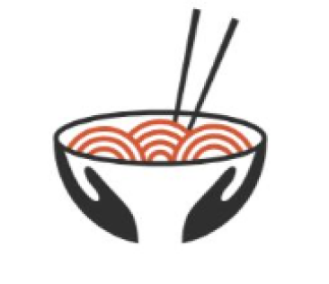

Eslogan:
Menos scroll más roll.

Miembros y nombre del equipo: DIU1_PAYA
 * :bust_in_silhouette:  Pablo Hodar Molina     — [:octocat: GitHub](https://github.com/ph0darm)   
 * :bust_in_silhouette:  Yaiza Perez Ocaña      — [:octocat: GitHub](https://github.com/yaizaperez)

 

# Proceso de Diseño 
## 1. UX User & Desk Research & Analisis 
### 1.a User Reseach Plan
El objetivo de este plan de investigación es comprender cómo interactúan los usuarios con las plataformas web de restaurantes temáticos y detectar posibles problemas de usabilidad antes de diseñar nuestra propuesta.

El restaurante elegido como referencia para el análisis es _Buga Ramen_, una cadena de restauración japonesa presente en varias ciudades de España. Su popularidad y reconocimiento la convierten en un caso de estudio adecuado para analizar estrategias de diseño digital, identidad visual y experiencia de usuario aplicadas a restaurantes temáticos.

 - **Identidad Visual:** La web de Buga Ramen utiliza una paleta de colores muy llamativa y una estética fuertemente asociada a la cultura japonesa.
   
 - **Calidad de Producto:** La reputación del restaurante está asociada a la calidad de sus productos. Nuestro objetivo es trasladar esta percepción positiva también al diseño digital, creando una experiencia coherente entre el producto y la interfaz web.
 - 
El **objetivo principal** de la investigación es comprender cómo interactúan los usuarios con plataformas digitales de restaurantes de este tipo, con el fin de diseñar una web intuitiva, accesible y agradable de utilizar.

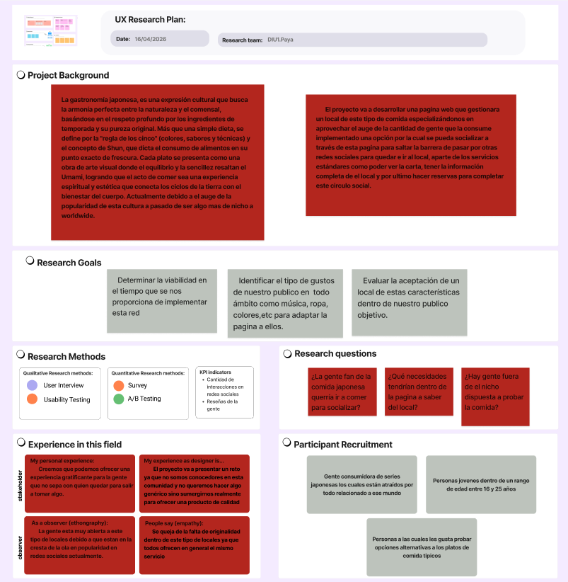

### 1.b Competitive Analysis
Hemos realizado un análisis comparativo de tres referentes del sector.

Tras el analisis, observamos una clara oportunidad de mercado: **la mayoría de los competidores fallan en la integración total de servicios o en la accesibilidad**. 
Nuestra propuesta se diferenciará por combinar la inmersión visual de *Uzumaki* con la robustez técnica de *Shifu*, añadiendo la capa social de eventos que ninguna de estas plataformas ofrece actualmente

### 1.c Personas 
Para entender a nuestro público, hemos desarrollado dos perfiles representativos. 

Para representar a uno de los principales perfiles de usuarios, presentamos a **Alberto**, un joven interesado en el anime y los videojuegos.
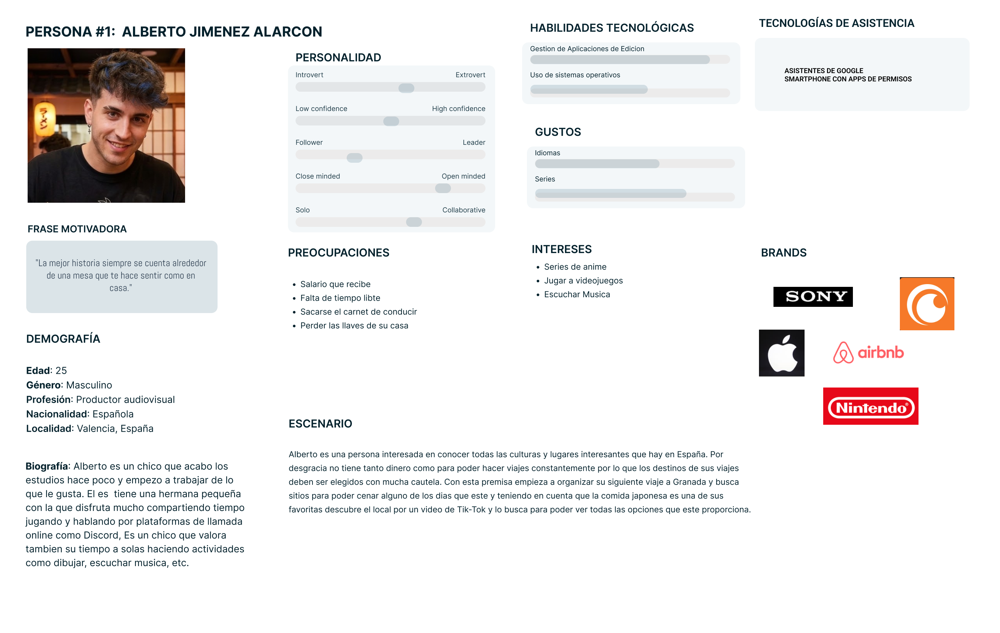

Por otro lado, presentamos a **Eva**, profesora de latín interesada en actividades culturales que le permitan socializar y conocer gente con intereses similares. 
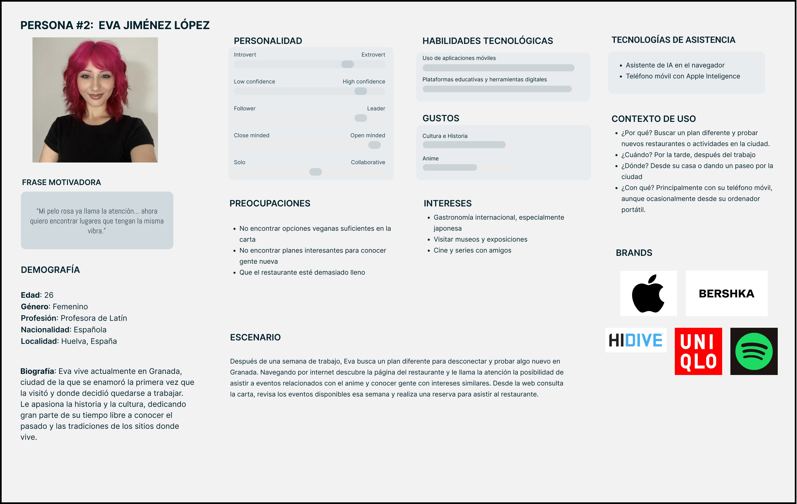

### 1.d User Journey Map
Analizamos los recorridos de nuestros dos perfiles principales para identificar puntos críticos en su experiencia:

* **Alberto:** Busca nuevas experiencias y salir de la monotonía. El mapa nos muestra que aunque la temática le atrae, la falta de claridad en la página web le generó dudas antes de la visita.
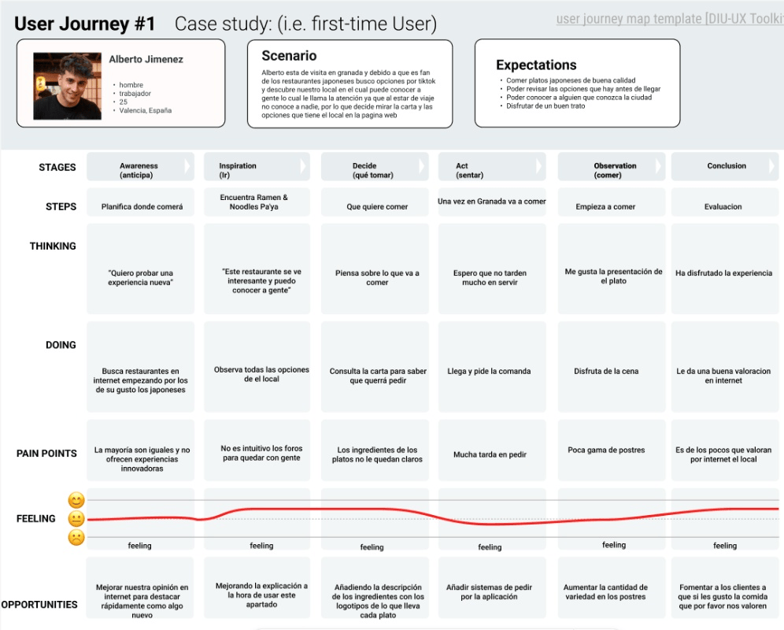

* **Eva:** Busca desconectar y conocer personas afines a ella. Su mapa muestra una evolución positiva: tras una fase de búsqueda de planes en Granada, logra una inmersión total gracias a los eventos temáticos del local, transformando una cena individual en una experiencia social satisfactoria.
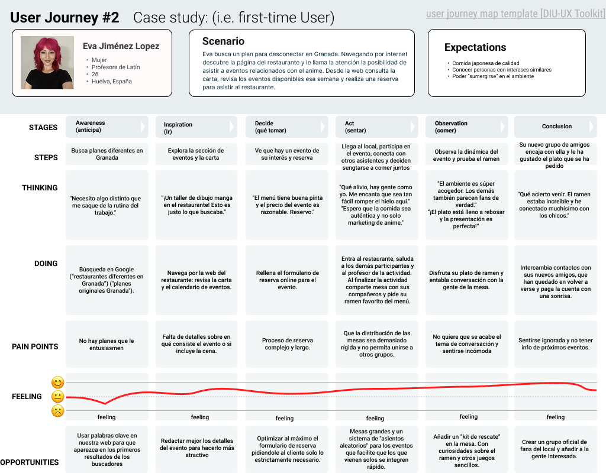

### 1.e Usability Review
[:page_facing_up: Ver Usuability Review](P1/UsabilityreviewPuntuado.pdf)

**Puntación obtenida por Buga Ramen: 64/100 (Moderate)** 
Tras realizar el análisis hemos concluido que, aunque la página es funcional y cumple con los requisitos mínimos, presenta fallos de usabilidad que afectan a la experiencia del usuario.

En particular, la jerarquía de información es confusa y la estética a veces sacrifica la legibilidad del contenido. 
Esto nos da una **oportunidad de mejora**: podemos ofrecer la misma potencia visual pero con una arquitectura de información más clara y una navegación más intuitiva.

---
 

## 2. UX Design 

### 2.a IDEACION: Feedback Capture Grid / Empathy map 

Mediante el uso de una malla receptora de información, se logró identificar que el restaurante destaca en Granada por su temática anime y diferenciación, aunque presenta deficiencias críticas en la gestión de reservas y el acceso a información sobre eventos y aforo. Esta fase de análisis permitió detectar una oportunidad clave para desarrollar herramientas que mejoren la comunicación operativa y fomenten la interacción social entre usuarios con intereses comunes.

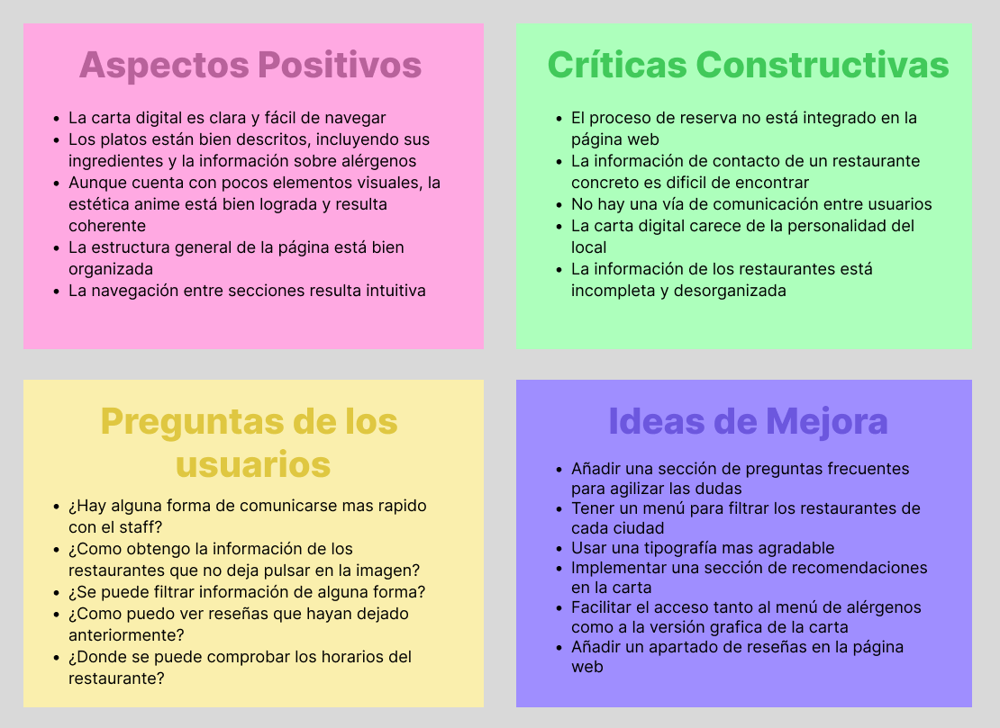

* Alberto

* Eva

### 2.b ScopeCanvas

Pa’ya evoluciona el restaurante temático hacia un ecosistema digital que fusiona gastronomía oriental con socialización real. Mediante reservas inteligentes, foros y eventos de anime, transformamos la cultura japonesa en un motor de comunidad accesible. Nuestra propuesta trasciende el plato para ofrecer una experiencia inmersiva donde cada visita genera conexiones auténticas. En definitiva, convertimos la pasión por el ramen en un punto de encuentro dinámico y recurrente.

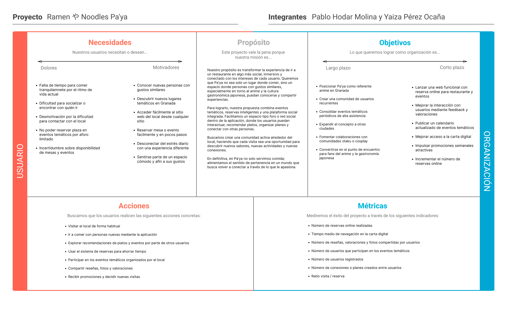 

### 2.b User Flow (task) analysis 
Mostramos el flujo de las tres tareas que consideramos más importantes:

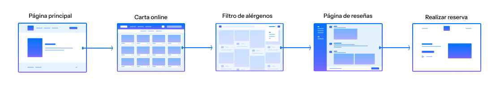 

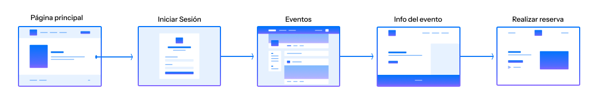 

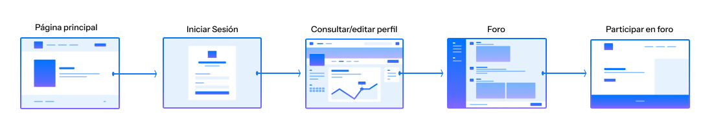 

### 2.c Sitemap + Labelling 

En este apartado realizaremos una organización de navegacion (menús) y etiquetas (labeling)

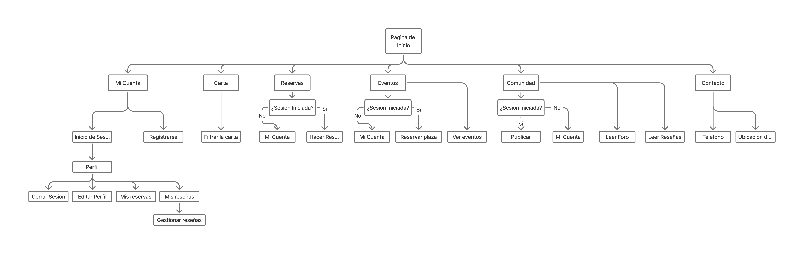 

| Tarea | Usuario | Usuario Registrado | Trabajadores | Joven Otaku | Adulto No Conocedor |
|---|---|---|---|---|---|
| Ver la carta | Alta | Alta | Baja | Alta | Alta |
| Opciones de filtrado de la carta | Moderada | Alta | Baja | Moderada | Alta |
| Leer reseñas y recomendaciones | Moderada | Alta | Baja | Alta | Alta |
| Acceder a datos del local | Moderada | Moderada | Alta | Baja | Alta |
| Consultar eventos temáticos | Moderada | Alta | Moderada | Alta | Moderada |
| Iniciar sesión | No usa | Alta | Alta | Alta | Baja |
| Hacer reserva | Moderada | Alta | Baja | Alta | Alta |
| Reservar plaza en eventos | No usa | Alta | Baja | Alta | Moderada |
| Acceder al foro | Baja | Alta | Moderada | Alta | Baja |
| Publicar en el foro | No usa | Moderada | Baja | Alta | No usa |
| Gestionar cuenta | No usa | Moderada | Alta | Moderada | Baja |
| Gestionar reservas | No usa | Baja | Alta | Baja | No usa |
| Gestionar eventos y aforo | No usa | No usa | Alta | No usa | No usa |
| Cerrar sesión | No usa | Moderada | Alta | Moderada | Baja |

### 2.d Wireframes
En esta parte hemos desarrollado los wireframes Lo-Fi en Figma. Hemos definido los layouts más relevantes de nuestra interfaz. El objetivo principal en esta etapa ha sido hacer evidente la jerarquía visual, la organización espacial y el protagonismo de los componentes principales.

* Página de inicio
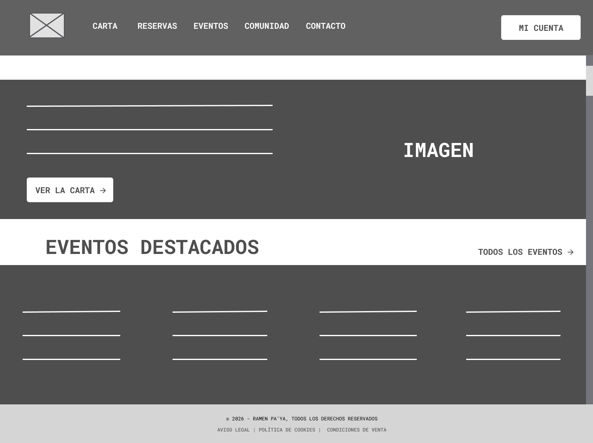

* Carta digital
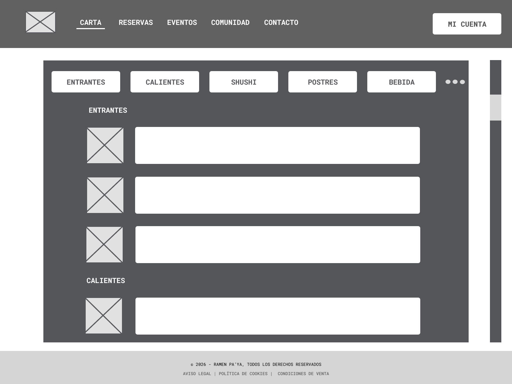

* Página de reservas
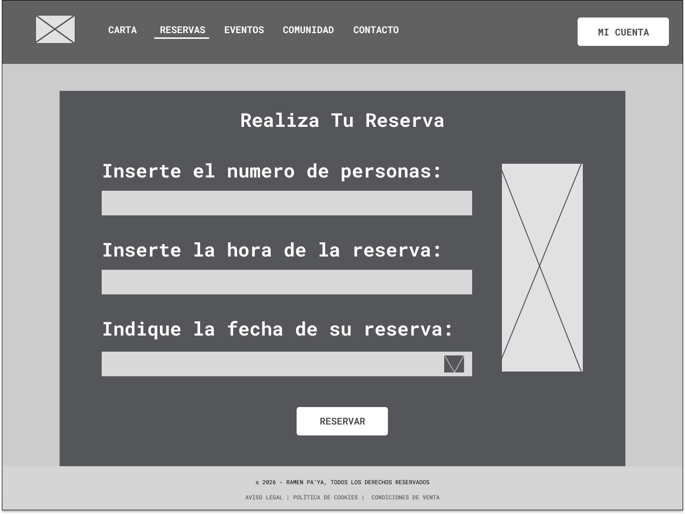 

* Página de próximos eventos
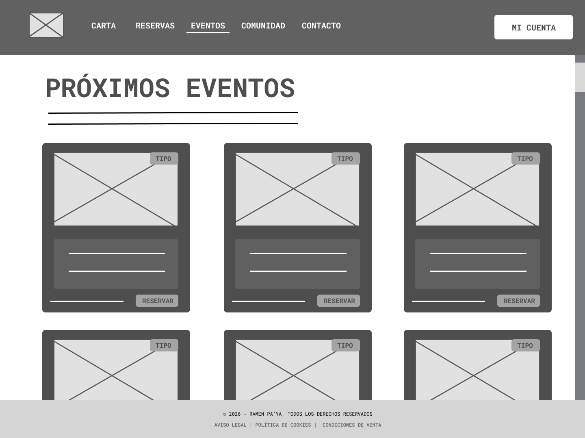

* El club de la comunidad Pa'ya
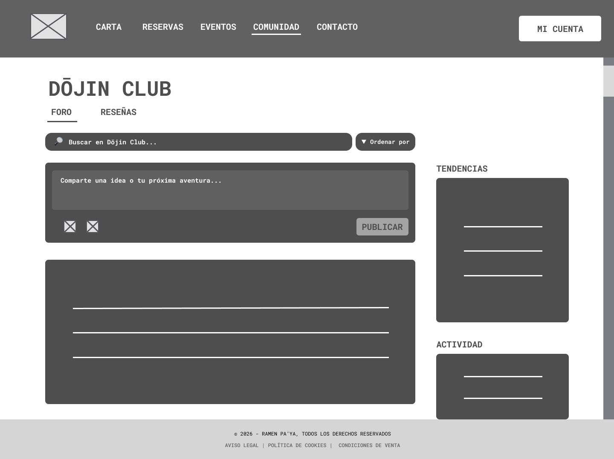

*Inicio de sesión
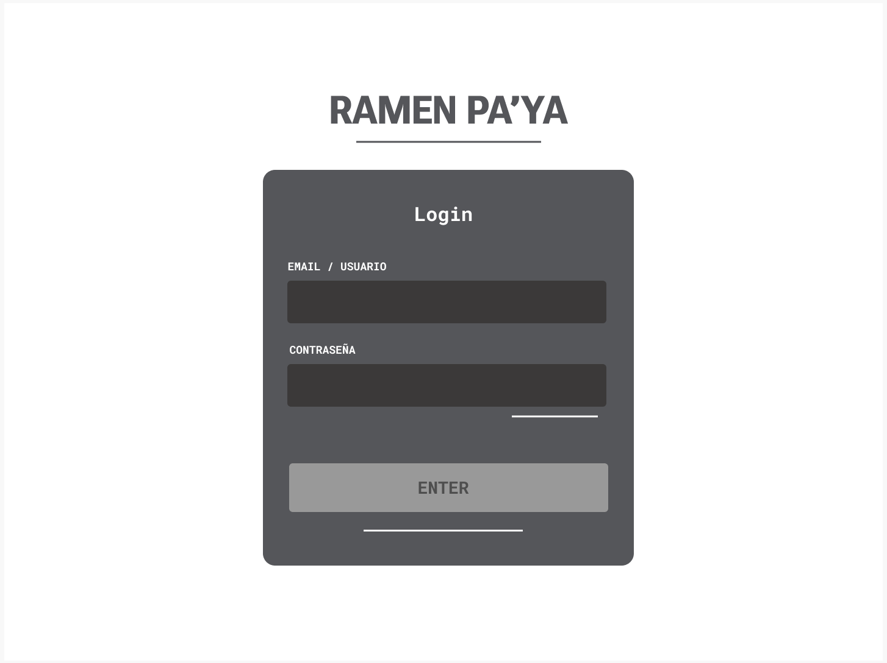

* Perfil de usuario
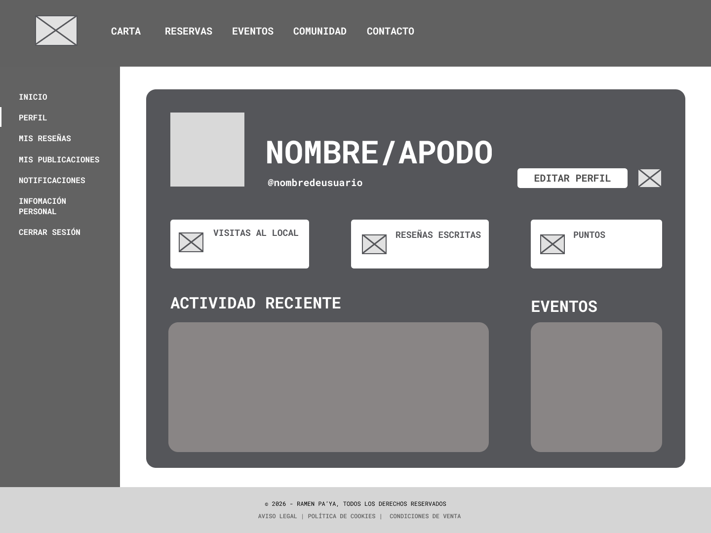

* Informacion del local
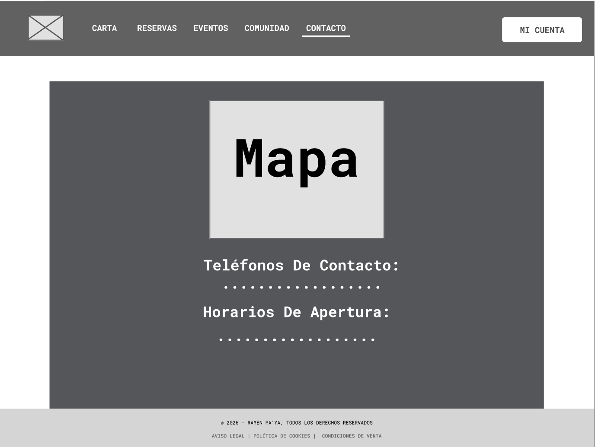 
